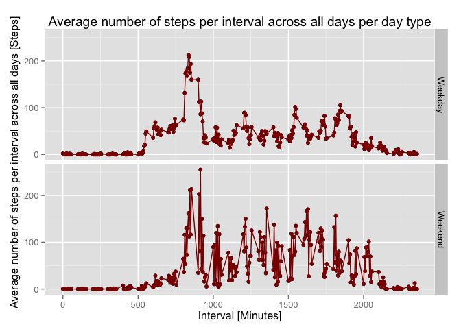

# Reproducible Research: Peer Assessment 1
Peng Cheng Zhang  


## 1. Loading and preprocessing the data
Before anything else, some packages that will be used are loaded.

```r
library(dplyr)
```

```
## 
## Attaching package: 'dplyr'
## 
## The following objects are masked from 'package:stats':
## 
##     filter, lag
## 
## The following objects are masked from 'package:base':
## 
##     intersect, setdiff, setequal, union
```

```r
library(lubridate)
library(ggplot2)
```

The data is load into R with the read.csv function.
It's converted into tbl_df form and stored as activity, with the Date parsed out separately.


```r
act1<-read.csv("./activity.csv")
activity<-tbl_df(act1)
rm("act1")
activity<-mutate(activity, Year=year(date), Month=month(date), Mday=mday(date),Wday=wday(date))
```

## 2. What is mean total number of steps taken per day?

Using the dplyr package tools, total number of steps taken per day is calculated and then plotted using the base plotting system as a histogram.

```r
Totalsteps<-summarise(group_by(activity, date), sum(steps))

hist(Totalsteps$sum, breaks=10, xlab="Total number of steps per day", main="Histogram of Total number of steps taken per day")
```

 

The mean and median total number of steps per day are calculated.

```r
meansteps1<-mean(Totalsteps[[2]],na.rm=TRUE)

mediansteps1<-median(Totalsteps[[2]],na.rm=TRUE)
```
Looks like the mean total number of steps per day is 1.0766 &times; 10<sup>4</sup>, and the median number of steps per day is 10765.
Note: that NA values are ignored in these calculations.

## 3. What is the average daily activity pattern?

To look at the average daily activity, the average number of steps taken during each 5 minute interval across all days are calculated. 
It is then plotted as time series using a line.

```r
int_mean<-summarise(group_by(activity,interval), Interval_mean=mean(steps,na.rm=TRUE))

plot(int_mean$interval,int_mean$Interval_mean,"l",main="Time Series of Average Steps Taken Across All Days", xlab="Interval",ylab="Average steps per interval")
```

 

For the data collected, we can find the the most active time interval across all days. It looks like interval 835 contains the maximum number of steps.


```r
int_mean[which.max(int_mean$Interval_mean),]
```

```
## Source: local data frame [1 x 2]
## 
##     interval Interval_mean
## 104      835         206.2
```

## 4. Imputing missing values

There seems to be ` r sum(is.na(activity$steps))` number of missing data points.

To fill in the missing data. We can just use a rounded average number of steps across all day for that interval.
We can then create a new data set now called Imp_Activity.


```r
Imp_activity<-mutate(group_by(activity,interval), avg_per_int=round(mean(steps,na.rm=TRUE)))

Imp_activity[is.na(Imp_activity)]<-Imp_activity$avg_per_int[is.na(Imp_activity)]
```

Now, let's see take a look at the histogram of total number of steps taken each day with the new data.

```r
Totalsteps2<-summarise(group_by(Imp_activity, date), sum(steps))

hist(Totalsteps2$sum, breaks=10, xlab="Total number of steps per day", main="Histogram of Total number of steps taken per day with simulated")
```

 

Then calculate the mean and median.

```r
meansteps2<-mean(Totalsteps2[[2]])

mediansteps2<-median(Totalsteps2[[2]])
```

Now, the mean total number of steps per day is 1.0766 &times; 10<sup>4</sup>, and the median number of steps per day is 1.0762 &times; 10<sup>4</sup>.
It doesn't look like the data is really that much different, both the mean and median are barely affected by us filling in the missing datas with a guess.

## 5. Are there differences in activity patterns between weekdays and weekends?

We now create a new factor dayorend, where Weekend and Weekday are the 2 factors, and a new column added to specify whether the data is collected on weekend or weekday.


```r
dayorend<-Imp_activity$Wday
dayorend[Imp_activity$Wday != c(1,7)] <-"Weekday"
dayorend[Imp_activity$Wday == c(1,7)] <-"Weekend"
IActivity<-cbind(Imp_activity,dayorend)
```

Finally, we calculate the mean steps taken during each interval for Weekend or Weekday and plot them using ggplot2 system.


```r
int_mean2<-summarise(group_by(IActivity,dayorend,interval), Interval_mean=mean(steps))
g <- qplot(interval, Interval_mean, data = int_mean2, facets = dayorend ~ .)
p <- g + geom_point(color = "dark red") +
     geom_line(color = "dark red") +
     labs(x = "Interval [Minutes]") +
     labs(y = expression("Average number of steps per interval across all days [Steps]")) +
     labs(title ="Average number of steps per interval across all days per day type")
 
print(p)
```

 


